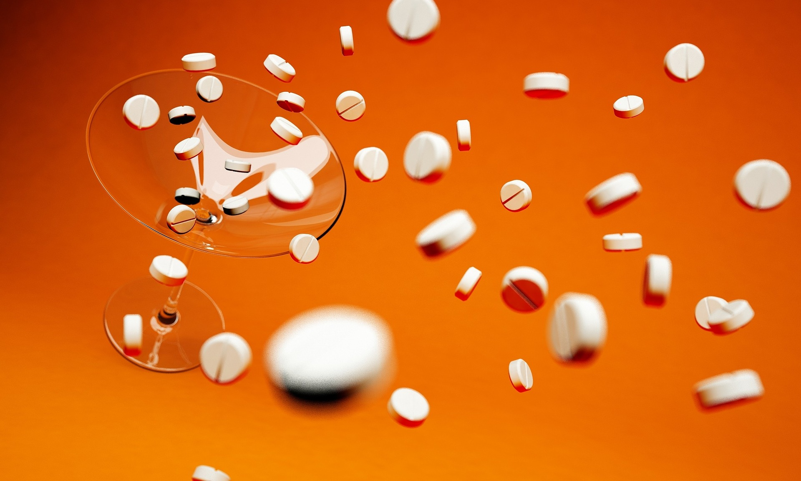

```{r setup, include=FALSE}
knitr::opts_chunk$set(echo = FALSE)
```
```{r, fig.align='center', out.width='100%'}

```

Premier Li Keqiang announced a medical reform measure at an executive meeting of the State Councila few days ago, sparking a firestorm of debate in the health industry.

Premier Li Keqiang announced that our country will remove import tariffs on anti-cancer drugs and encourage the import of innovative drugs. All common drugs, including anti-cancer drugs, alkaloid drugs with anti-cancer effects, and Chinese patent medicines that are actually imported, will be removed import tariffs on May 1, 2018, resulting all anti-cancer drugs actually imported with Zero Tariff.

As the policy's implementation date approaching, multinational pharmaceutical companies, Chinese innovative pharmaceutical companies, generic drug manufacturers, and pharmaceutical distribution companies in China may usher in a new round of changes.

"The reduction in tariffs on imported tumour drugs is an important demonstration of the change in the government's guiding ideology, representing a medical and health policy that is patient-centered. Chinese patients will be able to share the results of global medical innovation faster and cheaper thanks to accelerated approval of anti-cancer drugs and tariff reductions, allowing them to meet unmet clinical needs and better serve the health of the general public", Song Ruilin, executive chairman of China Pharmaceutical Innovation and Research Development Association（PhIRDA）, said in an interview with a reporter from China Business journal.

## Lower Drug Prices and Higher Social Welfare

Anti-cancer drugs have become "life-saving drugs" with urgent clinical needs in our country due to the rapid growth of the cancer patient population.

According to IMS data, China's anti-cancer drug market grew from 60.3 billion yuan to 110.9 billion yuan between 2012 and 2016, with an average annual compound growth rate of about 16.5%. In 2018, the market is expected to be worth 144.7 billion yuan.

Despite the large number of patients and high demand, various imported targeted drugs and innovative drugs have "held" China's anti-cancer drug market all year, and the high price often discourage patients. According to a report published in January 2018 from research institution GEN, "among top 10 best-selling anti-cancer drugs in the world in the First Three Quarters of 2017, six of them are lack domestic biosimilars.

Merck, Pfizer, and Bristol-Myers Squibb respectively manufactured three anti-cancer star products: Keytruda, Ibrance and Opdivo, whose sales increased rapidly in 2017. The three multinational pharmaceuticals all have a monopoly on exclusive anti-cancer drug respectively.

Patent restrictions limit the availability of these drugs, and the price is prohibitively high for most salaried people. Many people choose to give up treatments due to the unaffordable drug prices, while a few people are forced to purchase imported drugs from daigo , which is an illegal mean.

It has been one of livelihood issues that cancer patients have difficulties in getting medical service and affordable drugs. For this reason, some departments of state frequently collaborating to solve the problems.

The Ministry of Human Resources and Social Security issued "Notice on Adding 36 Drugs to the List of Medicines (Category B) Covered by National Medical-insurance System" in July 2017. This is a result of first "national negotiation for drug access". The average drop in negotiated drug prices compared to the average retail price in 2016 was 44%, with the highest drop being 70 %. Most imported drugs’ prices are lower than the surrounding international market price after negotiation, which significantly reduced the burden on patients.

While the state departments focus on the payment side of medical insurance, the market entry side of imported anti-cancer drugs has also beed regarded as a focal point for "lowering drug prices." The State Council's Customs Tariff Commission deliberated and approved in November 2017 that the tariffs on 26 types of imported drugs in our country would be uniformly lowered to 2% beginning December 1, 2017. Some pharmaceutical raw materials have been implemented with a zero tariff rate.

Previously, China's tariff rate for imported preparations was 4 % to 6 %, with a 17% value-added tax. The tariff and value-added tax on imported anti-cancer drugs will be reduced to 0% and 16% respectively, once the new policy implemented.

The market price of imported drugs is based on the product's ex-factory price/CIF price plus operating costs, which include tariffs, taxes, circulation costs, promotion costs and profits. Because the tariffs are added to the operating costs, lower tariffs means lower retail prices.

"The state's reduction of import tariffs on anti-cancer drugs directly reduces the cost of enterprises, and of course helps to decline the drug prices," Song Ruilin told reporters.

However, some industrial insiders think that more supportive policies at the national level are needed to promote policy dividends that truly benefit the people.

## Promote industrial upgrading##

" In a short period of time, the policy of zero tariffs on imported anti-cancer drugs will put tremendous pressure on the prices and profits of domestic pharmaceutical companies, particularly generic drug companies, but it can help innovative companies like Betta improve innovation capabilities and expand follow-up product line", A spokesman for Betta Pharmaceuticals Co. Ltd. said.

Icotinib, the first anti-lung cancer targeted drug produced by Betta with independent intellectual property rights, is a star of domestic anti-cancer drugs.Before Icotinib was produced, all argeted anti-cancer drugs in the treatment of lung cancer patients are imported drugs, including AstraZeneca's gefitinib and Roche's erlotinib, with high prices , 500 to 660 yuan per tablet. In 2011, icotinib produced by Betta was priced between 140 and 200 yuan per tablet. Betta participated in a national drug price negotiation in May 2016 and came to a mutually beneficial agreement with the government. Betta made a promise to lower the price of icotinib by 54% , pricing approximately 67 yuan per tablet.

Jiangsu Hengrui Medicine Co Ltd., a company that is active in the internationalisation of innovative drugs in recent years. Its share price unexpectedly plummeted after the zero-tariff policy for anti-cancer drugs announced.

"The impact of zero tariffs on anti-cancer drugs on the company has not yet been assessed," Liu Xiaohan, the board secretary of Hengrui Medicine, said in an interview with this reporter. The fluctuations of company's share price are probably due to the changes of market expectation".

Views from Song Ruilin,“More imported drugs entering China, allow patients to get drugs faster. On the other hand, this will help the development of China's pharmaceutical industry. Importing foreign innovative drugs encourages the imitation and development of Chinese generic drugs."

[*Original Website*](http://www.cb.com.cn/index/show/gs/cv/cv12523263193)