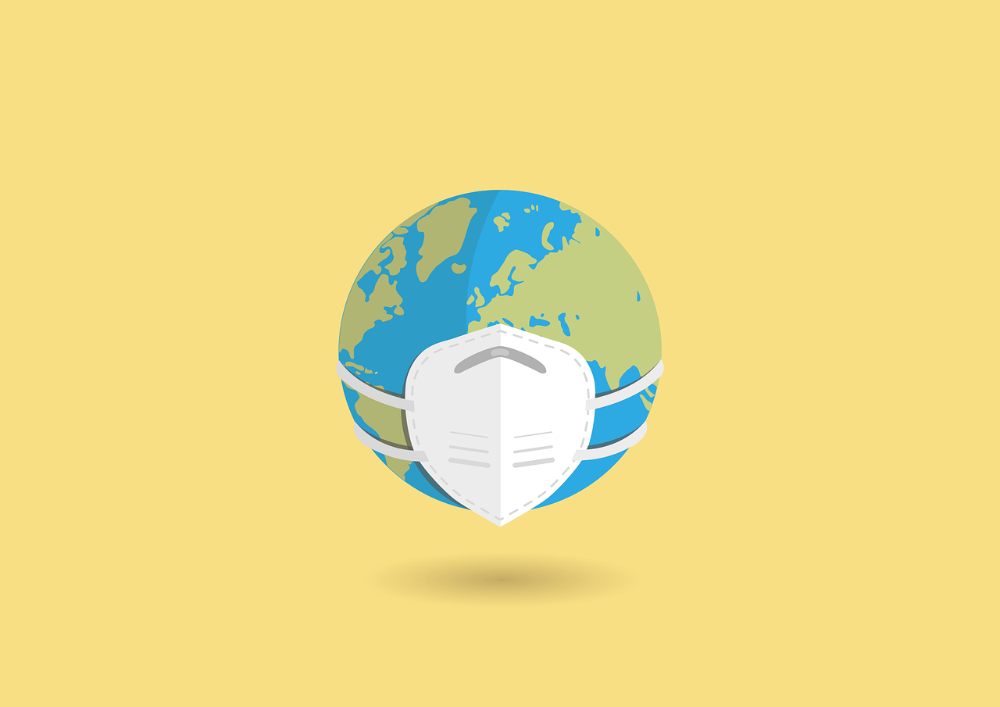

```{r setup, include=FALSE}
knitr::opts_chunk$set(echo = FALSE)
```
```{r, fig.align='center', out.width='100%'}

```
Since experts confirmed people-to-people transmission of 2019-nCoV, wearing masks has become a basic measure for the public to prevent the epidemic. With the sharp increase in the demand for masks from the public, the price of masks has risen significantly and been sold out in many parts of the country.

Is wearing a mask really effective in preventing infection with 2019-nCoV?

The World Health Organization (WHO) representative office in China said in an interview with a reporter from China Business Journal on January 24, "using a mask incorrectly may actually increase the risk of transmission, rather than reduce it. If masks are to be used, it should be combined with other general measures such as hand and respiratory hygiene".

Previously, WHO announced on its official website that measures to reduce the risk of coronavirus infection, including clean hands with soap and water or alcohol-based hand rub,cover nose and mouth when coughing andsneezing with tissue or flexed elbow, avoid close contact with anyone withcold or flu-like symptoms, thoroughly cook meat and eggs, avoid unprotected contact with livewild or farm animals.

“In our messaging to the public, WHO provided guidance for those individuals who choose to wear a mask – specifically, to ensure proper fit and coverage, avoid touching the mask once in place, immediately discard after use and washing your hands after removing masks", the WHO representative office in China replied.

In addition, WHO had issued " Advice on the use of masks in the community setting inlnfluenza A(H1N1) outbreaks", which mentioned that, " replace masks with a new clean, dry mask as soon as they become damp/humid; do not re-use single-use masks, and discard single-use masks after each use and dispose of them immediately upon removing”.

According to experts’ advices published on the official website of the National Health Commission of the PRC, “masks should be replaced in time to prevent viruses adhering to the outer surface of the masks from continuing to seep through the inner layer of the masks, thus affecting human health”.

On January 22, Wuhan issued a notice requiring people to wear masks before entering public places. In addition, the Headquarters for Preventing and controlling 2019-nCoV in Wuhan released information that among the shortage of medical supplies, masks are in great demand.

[Original Website](http://www.cb.com.cn/index/show/zj/cv/cv13474631263)

# Rlevant Coverage Website
<http://www.cb.com.cn/index/show/zj/cv/cv13474121262>

<http://www.cb.com.cn/index/show/zj/cv/cv13474281268>

<http://www.cb.com.cn/index/show/zj/cv/cv13474501260>

<http://www.cb.com.cn/index/show/zj/cv/cv13475711261>