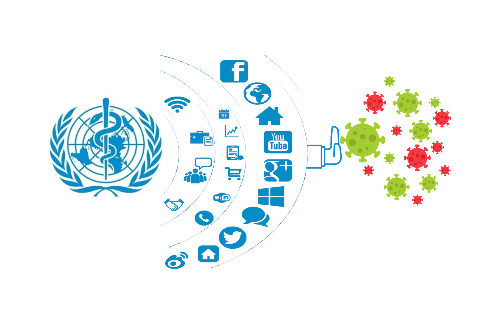
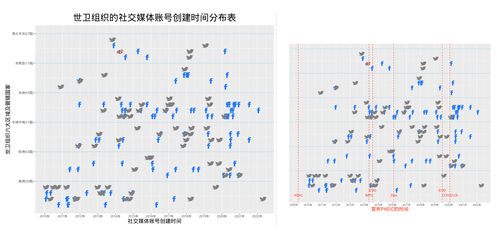
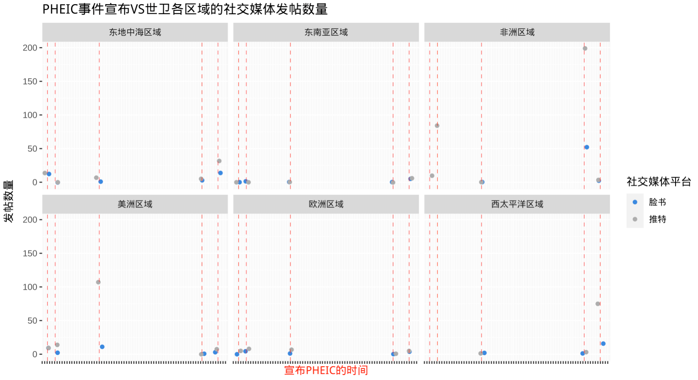
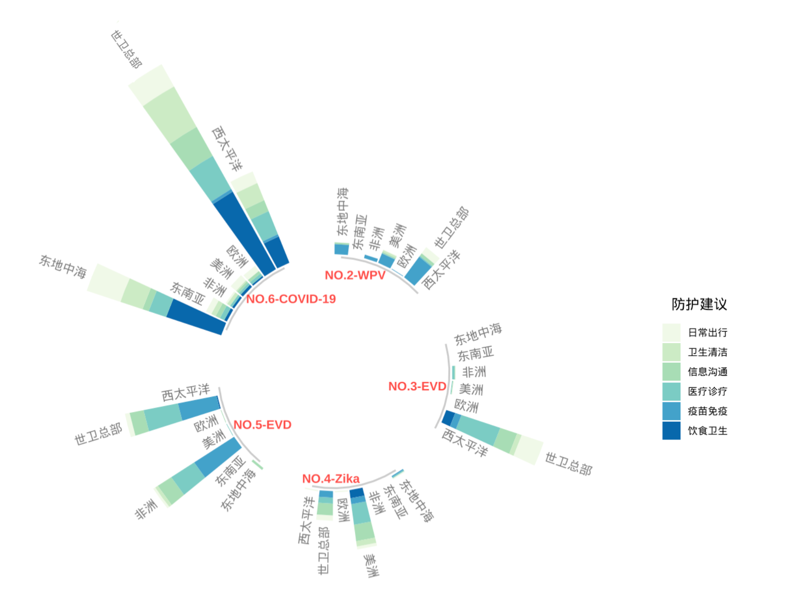

```{r setup, include=FALSE}
knitr::opts_chunk$set(echo = FALSE)
library(leaflet)
library(leafletCN)
library(leaftime)
library(leaflegend)
library(htmltools)
library(leaflet.extras)
library(amap)
library(readr)
library(lubridate)
library(dplyr)
library(tidyr)
library(leaflet.minicharts) 
library(rgeos)
library(geosphere)
library(mapdeck)
library(maps)
library(scales)
library(ggplot2)
library(ggimage)
library(rsvg)
library(plotly)
library(showtext)

```

```{r, fig.align='center', out.width='100%'}

```
<font size="3">&emsp;&emsp;2022年7月以来，全球猴痘确诊病例过万，疫情扩散至全球60余个国家。面对来势汹汹的猴痘疫情，世卫组织召开了第二次紧急委员会会议，并在推特上发布了这一消息。评估猴痘疫情是否构成“国际关注的突发公共卫生事件”（public health emergency of international concern，以下简称“PHEIC”），仍然是此次会议的重要议题。</font>

```{r fig.height=6, fig.width=6, message=FALSE, warning=FALSE, layout="l-body-outset"}
# 2022年猴痘疫情轨迹

MP <- read_csv("monkeypox.csv") %>% 
  mutate(start=ymd(start), end = ymd(end)) 

leaflet(geojsonio::geojson_json(MP)) %>%
  setView(lng = 44.8,lat = 41.68,zoom = 1.5) %>% 
  amap() %>%
  addTiles(map,
           urlTemplate = "https://server.arcgisonline.com/ArcGIS/rest/services/World_Shaded_Relief/MapServer/tile/{z}/{y}/{x}.png",
           attribution = "高德地图  GS(2021)6375号",options = tileOptions(minZoom = 0, maxZoom = 3,
                                                      opacity = 0.5))%>%
  addLayersControl(overlayGroups = c("2022年猴痘疫情地图<br>（数据截至2022/7/4）"),
                   options = layersControlOptions(collapsed = FALSE))%>%
  addTimeline(
    width = "20%",
    sliderOpts = sliderOptions(
      formatOutput = htmlwidgets::JS(
        "function(date) {return new Date(date).toDateString()}
      "),
      position = "topright",
      step = 60,
      duration = 6000,
      showTicks = TRUE,
      enablePlayback = TRUE,
      enableKeyboardControls = TRUE,
      waitToUpdateMap = FALSE),
    group = "2022年猴痘疫情地图<br>（数据截至2022/7/4）",
    timelineOpts = timelineOptions(
      styleOptions = styleOptions(
        radius = 1,
        color = "red",
        fillColor = "red",
        fillOpacity = 1))
  ) %>%
  addLegendImage(images = "GYJ.png",width = 15,height = 15,
                 labels = "红点代表报告猴痘确诊病例的国家",
                 group = "2022年猴痘疫情地图<br>（数据截至2022/7/4）",
               labelOptions(textsize = "2px"),
               orientation = 'vertical',
               title = htmltools::tags$div('',
                                             style = 'font-size: 2px; text-align: center;'),
               position = 'topright')
  


```
<font size="2"><center>**图1&emsp;&emsp;2022年猴痘疫情全球扩散轨迹**</center></font>
<font size="2"><center>注：疫情扩散轨迹以世卫组织会员国首次报告猴痘确诊病例日期为时间线。点击右上角播放控件动态呈现疫情扩散轨迹。</center>
</center>猴痘确诊病例数据来源：世卫组织官网《猴痘疫情情况报告》*https://www.who.int/publications/m/item/multi-country-outbreak-of-monkeypox--external-situation-report--1---6-july-2022*</center></font>

<font size="3">&emsp;&emsp;来自尼日利亚的谢伊·卡利，在推特上关注着世卫组织的紧急会议进展。尽管尼日利亚自2017年爆发猴痘疫情后流行至今，但近期出现的猴痘病例迅速增加，甚至出现了1例死亡病例，这让谢伊有些担忧。他希望及时了解猴痘疫情扩散情况，获取预防猴痘的有效建议，世卫组织总部的推特发帖一直是他的首选信源。<br>
&emsp;&emsp;在推特平台上，世卫组织总部的官方认证账号拥有1100万像谢伊这样的粉丝，而在脸书、微博平台上，其粉丝数量分别达到了3800万、225万。此外，世卫组织的六大区域办事处、会员国办事处纷纷在社交媒体平台上创建账号，逐渐形成了一张以世卫组织总部、区域办事处、国家办事处的社交媒体账号为节点的信息传播网。<br>
&emsp;&emsp;随着疫情大范围流窜扩散，通过信息传播网将疫情动态、疾病科普、防护建议等同步传播至全球各地，帮助公众获取所需信息以保护和改善自身健康，成为世卫组织应对PHEIC事件的重要法门。信息传播“跑赢”病毒传播，意味着在“战疫”过程中占得先机。公众根据科学信息采取有效的防护举措，合力遏制疫情。然而，随着社交媒体广泛渗透至生活日常，掺杂虚假信息、谣言的“信息疫情”不胫而走。有时虚假信息的传播“跑赢”了病毒传播，但人们根据虚假信息作出错误决策、盲目采取行动，反而加速疫情扩散。在一次次与PHEIC事件对弈过招中，世卫组织的社交媒体“战疫术”愈发娴熟，但同时也面临新考验。</font>


## 一组猴痘疫情信息的50次发布

<font size="3">&emsp;&emsp;自2022年5月13日英国向世卫组织报告本土出现猴痘确诊病例以来，该轮猴痘疫情在欧洲、美洲等非流行地区迅速蔓延。期间，世卫组织通过其主要社交媒体渠道持续发布疫情变化情况、疾病科普及预防建议等信息。<br>
&emsp;&emsp;当尼日利亚的谢伊在推特平台上查看世卫组织总部的推文以了解猴痘扩散趋势时，来自东南亚岛国东帝汶的贝洛德斯，正在脸书平台上查看世卫组织东帝汶办事处发布的猴痘症状科普视频。与此同时，来自中国的罗晓在微博平台上转发了世卫组织驻华代表处发布的《世卫组织关于猴痘常见问题的官方解答》一文。谢伊、贝洛德斯与罗晓从不同社交媒体平台上获取的猴痘疫情信息，尽管形式各异、语言不同，但它们有着相同的来源——世卫组织的猴痘疫情沟通文库。此类文库，有时以在线文档的形式出现，有时被纳入命名为“沟通工具箱”的指南中。它们像是世卫组织应对PHEIC事件的“装备库”。其中分门别类陈设的科普文章、信息图、互动问答、科普视频等，就像一件件制作精良地“防护服”，随时等待世卫组织的各个传播渠道取用，提供给世界各地的公众，以防控疫情侵扰。据不完全统计，2022年5月以来，至少50个世卫组织相关的社交媒体账号发布了内容相同、形式各异的猴痘疫情科普信息。这些社交媒体账号间的信息流动如图2所示。</font>

```{r fig.height=6, fig.width=6, message=FALSE, warning=FALSE, layout="l-body-outset"}
#猴痘疫情中世卫三级信息传导机制
THQR <- read.csv("T-总部+区域.csv")
FHQR <- read.csv("F-总部+区域.csv")
TWHO_R <- read.csv("T-WHO发给region.csv")
FWHO_R <- read.csv("F-WHO发给region.csv")
Region <- read.csv("WHO-region.csv")
W_CN <- read.csv("W-WHO发给CN.csv")
ENW <- read.csv("EN发给WHO.csv")
T_F_C <- read.csv("T-MP-AFRO-C.csv")
T_M_C <- read.csv("T-MP-AMRO-C.csv")
T_D_C <- read.csv("T-MP-EMRO-C.csv")
T_O_C <- read.csv("T-MP-EURO-C.csv")
T_X_C <- read.csv("T-MP-WPRO-C.csv")
T_SE_C <- read.csv("T-MP-SEARO-C.csv")
F_F_C <- read.csv("F-MP-AFRO-C.csv")
F_M_C <- read.csv("F-MP-AMRO-C.csv")
F_D_C <- read.csv("F-MP-EMRO-C.csv")
F_O_C <- read.csv("F-MP-EURO-C.csv")
F_X_C <- read.csv("F-MP-WPRO-C.csv")
F_SE_C <- read.csv("F-MP-SEARO-C.csv")
FMPC <- read.csv("F-MP-C.csv")
TMPC <- read.csv("T-MP-C.csv")

WHO <- awesomeIcons(
  markerColor = 'blue',
  iconColor = 'white',
  library = 'ion',
  text = "WHO",
  fontFamily = "monospace",
  squareMarker = FALSE
)
Ricons <- awesomeIcons(
  markerColor = "darkblue",
  iconColor = 'white',
  library = 'ion',
  text = Region$rname,
  fontFamily = "monospace",
  squareMarker = FALSE
)
euroicons <- awesomeIcons(
  markerColor = "darkblue",
  iconColor = 'white',
  library = 'ion',
  text = "EURO",
  fontFamily = "monospace",
  squareMarker = FALSE
)

leaflet() %>%  
  setView(lng = 44.8,lat = 31.68,zoom = 1.5) %>% 
  amap() %>%
  addTiles(map,
           urlTemplate = "https://server.arcgisonline.com/ArcGIS/rest/services/World_Shaded_Relief/MapServer/tile/{z}/{y}/{x}.png",
           attribution = "高德地图  GS(2021)6375号",options = tileOptions(minZoom = 0, maxZoom = 3,
                                                      opacity = 0.5))%>%
  addAwesomeMarkers(lng = 6.14,lat = 46.21,icon= WHO,label = "世卫组织总部")%>%
  addAwesomeMarkers(Region$lng,Region$lat,icon=Ricons,label = Region$name)%>% 
  addAwesomeMarkers(12.53,55.68,icon=euroicons,
                    label = "2022/5/21,世卫欧洲区域办事处在推特发布猴痘科普信息",)%>% 
  addCircleMarkers(-0.13,51.58,radius = 1,color ="#009fd5",opacity = 1,
                   fillOpacity = 0.1,fillColor = "#009fd5", 
                   label = "2022/5/13,英国向世卫报告2例猴痘确诊病例") %>%
  addCircleMarkers(116.33,39.92,radius = 1,color ="#009fd5",opacity = 1,
                   fillOpacity = 0.1,fillColor = "#009fd5",label = "中国") %>%
  addCircleMarkers(FMPC$lng,FMPC$lat,radius = 1,color ="#009fd5",opacity = 1,
                   fillOpacity = 0.1,fillColor = "#009fd5", 
                   label = FMPC$name) %>%
  addCircleMarkers(TMPC$lng,TMPC$lat,radius = 1,color ="#009fd5",opacity = 1,
                   fillOpacity = 0.1,fillColor = "#009fd5", 
                   label = TMPC$name) %>%
  addFlows(
    ENW$lng0, ENW$lat0, ENW$lng1, ENW$lat1,
    opacity = 1,
    flow = 1,
    color = "#009fd5",
    maxThickness = 1,
    dir = 1,
    popup = popupArgs(labels = "2022/5/13,英国首次向世卫报告2例猴痘确诊病例")) %>%
  addFlows(
    TWHO_R$lng0, TWHO_R$lat0, TWHO_R$lng1, TWHO_R$lat1,
    opacity = 0.5,
    flow = TWHO_R$Tposts,
    color = "#adadad",
    maxThickness = 1,
    dir = 1) %>%
  addFlows(
    T_F_C$lng0, T_F_C$lat0, T_F_C$lng1, T_F_C$lat1,
    opacity = 0.5,
    flow = T_F_C$Tposts,
    color = "#adadad",
    maxThickness = 1,
    dir = 1) %>%
  addFlows(
    T_M_C$lng0, T_M_C$lat0, T_M_C$lng1, T_M_C$lat1,
    opacity = 0.5,
    flow = T_M_C$Tposts,
    color = "#adadad",
    maxThickness = 1,
    dir = 1) %>%
  addFlows(
    T_O_C$lng0, T_O_C$lat0, T_O_C$lng1, T_O_C$lat1,
    opacity = 0.5,
    flow = T_O_C$Tposts,
    color = "#adadad",
    maxThickness = 1,
    dir = 1) %>%
  addFlows(
    T_D_C$lng0, T_D_C$lat0, T_D_C$lng1, T_D_C$lat1,
    opacity = 0.5,
    flow = T_D_C$Tposts,
    color = "#adadad",
    maxThickness = 1,
    dir = 1) %>%
  addFlows(
    T_X_C$lng0, T_X_C$lat0, T_X_C$lng1, T_X_C$lat1,
    opacity = 0.5,
    flow = T_X_C$Tposts,
    color = "#adadad",
    maxThickness = 1,
    dir = 1) %>%
  addFlows(
    T_SE_C$lng0, T_SE_C$lat0, T_SE_C$lng1, T_SE_C$lat1,
    opacity = 0.5,
    flow = T_SE_C$Tposts,
    color = "#adadad",
    maxThickness = 1,
    dir = 1) %>%
  addFlows(
    FWHO_R$lng0, FWHO_R$lat0, FWHO_R$lng1, FWHO_R$lat1,
    flow = FWHO_R$Fposts,
    dir = 1,
    opacity = 0.9,
    maxThickness = 1,
    color = "#3a89e0")%>%
  addFlows(
    F_F_C$lng0, F_F_C$lat0, F_F_C$lng1, F_F_C$lat1,
    flow = F_F_C$Fposts,
    dir = 1,
    opacity = 0.9,
    maxThickness = 1,
    color = "#3a89e0")%>%
  addFlows(
    F_M_C$lng0, F_M_C$lat0, F_M_C$lng1, F_M_C$lat1,
    flow = F_M_C$Fposts,
    dir = 1,
    opacity = 0.9,
    maxThickness = 1,
    color = "#3a89e0")%>%
  addFlows(
    F_O_C$lng0, F_O_C$lat0, F_O_C$lng1, F_O_C$lat1,
    flow = F_O_C$Fposts,
    dir = 1,
    opacity = 0.9,
    maxThickness = 1,
    color = "#3a89e0")%>%
  addFlows(
    F_D_C$lng0, F_D_C$lat0, F_D_C$lng1, F_D_C$lat1,
    flow = F_D_C$Fposts,
    dir = 1,
    opacity = 0.9,
    maxThickness = 1,
    color = "#3a89e0")%>%
  addFlows(
    F_X_C$lng0, F_X_C$lat0, F_X_C$lng1, F_X_C$lat1,
    flow = F_X_C$Fposts,
    dir = 1,
    opacity = 0.9,
    maxThickness = 1,
    color = "#3a89e0")%>%
  addFlows(
    F_SE_C$lng0, F_SE_C$lat0, F_SE_C$lng1, F_SE_C$lat1,
    flow = F_SE_C$Fposts,
    dir = 1,
    opacity = 0.9,
    maxThickness = 1,
    color = "#3a89e0")%>%
  addFlows(
    W_CN$lng0, W_CN$lat0, W_CN$lng1, W_CN$lat1, 
    dir = 1,
    flow = W_CN$Wposts,
    opacity = 0.8,
    color = "#f4cccc",
    maxThickness = 1,
    popup = popupArgs(labels = "转发世卫总部发帖数量")
  )%>%
  addLegendImage(images = c("Warrow.png","Farrow.png","Tarrow.png","WHOarrow.png"),width = 13,height = 13,
               labels = c("微博信息传播","脸书信息传播","推特信息传播","世卫官网信息传播"),
               labelStyle = 'font-size: 13px',
               labelOptions(textsize = "7px"),
               orientation = 'vertical',
               title = htmltools::tags$div('图例',
                                           style = 'font-size: 13px; text-align: center;'),
               position = 'topright')

```
<font size="2"><center>**图2&emsp;&emsp;2022年猴痘疫情初期，世卫组织部分社交媒体账号间的信息流动**</center></font>
<font size="2"><center>注：箭头表示信息流向，每个图标动态备注了世卫组织信息发布主体。</center></font>

<font size="3">&emsp;&emsp;统一的疫情科普信息，再借由社交媒体账号矩阵构筑的网络传播，世卫组织在PHEIC事件应对中实现了“一呼百应”。据不完全统计，截至2022年5月20日，世卫组织在推特上拥有75个认证账号，在脸书上拥有104个认证账号，新浪微博上拥有1个认证账号。这些账号分属世卫组织总部、区域办事处、国家办事处。在图3中，将世卫组织的社交媒体账号标记在地图上可见，世卫组织六大区域中，美洲区域、非洲区域、东地中海区域的会员国，在推特和脸书上创建官方认证账号的比例相对较高。在图4中，将世卫组织现有社交媒体帐号根据账号创建时间标记可见，大多数账号创建于2012年～2021年间。若以世卫组织应对六次PHEIC事件的时间作为参照，每次应对PHEIC后，疫情主要暴发的区域，有更多的会员国办事处创建账号，加入世卫组织的社交媒体信息传播网。</font>

```{r fig.height=6, fig.width=6, message=FALSE, warning=FALSE, layout="l-body-outset"}

TR <- read.csv("T-WHOR.csv")
FR<- read.csv("F-WHOR.csv")
Member <- read.csv("世卫会员国.csv")
Taccount <- read.csv("T-世卫会员国.csv")
Faccount <- read.csv("F-世卫会员国.csv")
Waccount <- read.csv("W-世卫会员国.csv")
df<- read.csv("WHOtoR.csv")
p1 <- as.matrix(df[,c(3,4)])
p2 <- as.matrix(df[,c(5,6)])
df2 <- gcIntermediate(
  p1, p2, 
  addStartEnd = TRUE,
  sp = T)
df2a <- df2
slot(df2a, "lines") <- lapply(slot(df2a, "lines"), function(item) {
  lines <- slot(item, "Lines")
  slot(item, "Lines") <- lapply(lines, function(line) {
    dt <- slot(line, "coords")
    # wrap around 0deg not at 180deg
    dt[, "lon"] <- (dt[, "lon"] ) 
    slot(line, "coords") <- dt
    line
  })
  item
})

dfAFRO<- read.csv("AFROtoC.csv")
p3 <- as.matrix(dfAFRO[,c(3,4)])
p4 <- as.matrix(dfAFRO[,c(5,6)])
df3 <- gcIntermediate(
  p3, p4, 
  addStartEnd = TRUE,
  sp = T)
df3a <- df3
slot(df3a, "lines") <- lapply(slot(df3a, "lines"), function(item) {
  lines <- slot(item, "Lines")
  slot(item, "Lines") <- lapply(lines, function(line) {
    dt <- slot(line, "coords")
    # wrap around 0deg not at 180deg
    dt[, "lon"] <- (dt[, "lon"] ) 
    slot(line, "coords") <- dt
    line
  })
  item
})

dfAMRO<- read.csv("AMROtoC.csv")
p5 <- as.matrix(dfAMRO[,c(3,4)])
p6 <- as.matrix(dfAMRO[,c(5,6)])
df5 <- gcIntermediate(
  p5, p6, 
  addStartEnd = TRUE,
  sp = T)
df5a <- df5
slot(df5a, "lines") <- lapply(slot(df5a, "lines"), function(item) {
  lines <- slot(item, "Lines")
  slot(item, "Lines") <- lapply(lines, function(line) {
    dt <- slot(line, "coords")
    # wrap around 0deg not at 180deg
    dt[, "lon"] <- (dt[, "lon"] ) 
    slot(line, "coords") <- dt
    line
  })
  item
})

dfEURO<- read.csv("EUROtoC.csv")
p7 <- as.matrix(dfEURO[,c(3,4)])
p8 <- as.matrix(dfEURO[,c(5,6)])
df7 <- gcIntermediate(
  p7, p8, 
  addStartEnd = TRUE,
  sp = T)
df7a <- df7
slot(df7a, "lines") <- lapply(slot(df7a, "lines"), function(item) {
  lines <- slot(item, "Lines")
  slot(item, "Lines") <- lapply(lines, function(line) {
    dt <- slot(line, "coords")
    # wrap around 0deg not at 180deg
    dt[, "lon"] <- (dt[, "lon"] ) 
    slot(line, "coords") <- dt
    line
  })
  item
})

dfSEARO<- read.csv("SEAROtoC.csv")
p9 <- as.matrix(dfSEARO[,c(3,4)])
p10 <- as.matrix(dfSEARO[,c(5,6)])
df9 <- gcIntermediate(
  p9, p10, 
  addStartEnd = TRUE,
  sp = T)
df9a <- df9
slot(df9a, "lines") <- lapply(slot(df9a, "lines"), function(item) {
  lines <- slot(item, "Lines")
  slot(item, "Lines") <- lapply(lines, function(line) {
    dt <- slot(line, "coords")
    # wrap around 0deg not at 180deg
    dt[, "lon"] <- (dt[, "lon"] ) 
    slot(line, "coords") <- dt
    line
  })
  item
})

dfEMRO<- read.csv("EMROtoC.csv")
p11 <- as.matrix(dfEMRO[,c(3,4)])
p12 <- as.matrix(dfEMRO[,c(5,6)])
df11 <- gcIntermediate(
  p11, p12, 
  addStartEnd = TRUE,
  sp = T)
df11a <- df11
slot(df11a, "lines") <- lapply(slot(df11a, "lines"), function(item) {
  lines <- slot(item, "Lines")
  slot(item, "Lines") <- lapply(lines, function(line) {
    dt <- slot(line, "coords")
    # wrap around 0deg not at 180deg
    dt[, "lon"] <- (dt[, "lon"] ) 
    slot(line, "coords") <- dt
    line
  })
  item
})

dfWPRO<- read.csv("WPROtoC.csv")
p13 <- as.matrix(dfWPRO[,c(3,4)])
p14 <- as.matrix(dfWPRO[,c(5,6)])
df13 <- gcIntermediate(
  p13, p14, 
  addStartEnd = TRUE,
  sp = T)
df13a <- df13
slot(df13a, "lines") <- lapply(slot(df13a, "lines"), function(item) {
  lines <- slot(item, "Lines")
  slot(item, "Lines") <- lapply(lines, function(line) {
    dt <- slot(line, "coords")
    # wrap around 0deg not at 180deg
    dt[, "lon"] <- (dt[, "lon"] ) 
    slot(line, "coords") <- dt
    line
  })
  item
})


WHO <- awesomeIcons(
  markerColor = 'blue',
  iconColor = 'white',
  library = 'ion',
  text = "WHO",
  fontFamily = "monospace",
  squareMarker = FALSE
)

RFcon <- makeIcon(
  iconUrl = "facebook-128.png",
  iconWidth = 22, iconHeight = 22,
  iconAnchorX = 11, iconAnchorY = 1
)

RTcon <- makeIcon(
  iconUrl = "T.svg",
  iconWidth = 22, iconHeight = 22,
  iconAnchorX = 1, iconAnchorY = 1
)

Fcon <- makeIcon(
  iconUrl = "facebook-128.png",
  iconWidth = 13, iconHeight = 13,
  iconAnchorX = 10, iconAnchorY = 10
)

Tcon <- makeIcon(
  iconUrl = "T.svg",
  iconWidth = 10, iconHeight = 10,
  iconAnchorX = 1, iconAnchorY = 10
)

Wcon <- makeIcon(
  iconUrl = "W.svg",
  iconWidth = 10, iconHeight = 10,
  iconAnchorX = 5, iconAnchorY = 10
)

leaflet() %>%  
  setView(lng = 44.8,lat = 41.68,zoom = 1.5) %>% 
  amap() %>%
  addTiles(map,
           urlTemplate = "https://server.arcgisonline.com/ArcGIS/rest/services/World_Shaded_Relief/MapServer/tile/{z}/{y}/{x}.png",
           attribution = "高德地图  GS(2021)6375号",options = tileOptions(minZoom = 0, maxZoom = 3,opacity = 0.5))%>%
  addLayersControl(overlayGroups = c("世卫社交媒体账号","世卫社交媒体信息传播网"),
                   options = layersControlOptions(collapsed = FALSE))%>%
  #加世卫总部图标
  addAwesomeMarkers(lng = 6.14,lat = 46.21,icon= WHO,label = "世卫组织总部",group = "世卫社交媒体账号")%>% 
  #加世卫区域办公室图标
  addMarkers(TR$lng,TR$lat,icon=RTcon,options = markerOptions(opacity = 0.5),label = TR$name,
             group = "世卫社交媒体账号") %>%
  addMarkers(FR$lng,FR$lat,icon=RFcon,options = markerOptions(opacity = 1),label = FR$name,
             group = "世卫社交媒体账号") %>%
  #加世卫会员国社交媒体图标
  addMarkers(Taccount$lng,Taccount$lat,label = Taccount$name,icon = Tcon,group = "世卫社交媒体账号",
             options = markerOptions(opacity = 0.5))%>%
  addMarkers(Faccount$lng,Faccount$lat,label = Faccount$name,icon = Fcon,group = "世卫社交媒体账号",
             options = markerOptions(opacity = 0.8))%>%
  addMarkers(116.33,39.92,label = Waccount$name,icon = Wcon,group = "世卫社交媒体账号",
             options = markerOptions(opacity = 0.7)) %>%
  addPolylines(data = df2a, weight = 2,color = "lightblue",opacity = 0.8,group = "世卫社交媒体信息传播网")%>%
  addPolylines(data = df3a, weight = 0.4,color = "#FFD13B",opacity = 0.5,group = "世卫社交媒体信息传播网")%>%
  addPolylines(data = df7a, weight = 0.4,color = "#403C3E",opacity = 0.5,group = "世卫社交媒体信息传播网")%>%
  addPolylines(data = df9a, weight = 0.4,color = "#078F19",opacity = 0.5,group = "世卫社交媒体信息传播网")%>%
  addPolylines(data = df11a, weight = 0.4,color = "#DC7DFF",opacity = 0.5,group = "世卫社交媒体信息传播网")%>%
  addPolylines(data = df13a, weight = 0.4,color = "#2450FF",opacity = 0.5,group = "世卫社交媒体信息传播网")%>%
  addPolylines(data = df5a, weight = 0.4,color = "#FF2D0D",opacity = 0.5,group = "世卫社交媒体信息传播网")%>%
  addLegendImage(images = c("AFRO.png","AMRO.png","EURO.png","SEARO.png","EMRO.png","WPRO.png"),width = 13,height = 13,
                 labels = c("世卫非洲区域","世卫美洲区域","世卫欧洲区域","世卫东南亚区域","世卫东地中海区域","世卫西太平洋区域"),
                 labelStyle = 'font-size: 5px',
                 labelOptions(textsize = "8px"),
                 group = "世卫社交媒体信息传播网",
                 orientation = 'vertical',
                 title = htmltools::tags$div('信息传播网分管区域',
                                             style = 'font-size: 5px; text-align: center;'),
                 position = 'topright')
```
<font size="2"><center>**图3&emsp;&emsp;世卫组织社交媒体账号分布及信息传播网**</center></font>
<font size="2"><center>注：不同社交媒体平台图标代表相关平台上的账号，每个图标动态备注了账号主体名称，地图右上角选择框可切换。</center></font>

```{r  layout="l-screen-inset shaded"}

```
<font size="2"><center>**图4&emsp;&emsp;世卫组织的社交媒体账号创建时间分布表**</center></font>
<font size="2"><center>不同社交媒体平台图标代表相关平台上的账号，每个图标动态备注了账号主体名称。</center>
注：根据《国际卫生条例（2005）》所附的决策文件规定，世卫组织宣布有可能构成PHEIC所依据的标准包括四条：事件对公共卫生影响的严重性；事件性质的不寻常或意外；事件有可能在国际间传播；事件有可能引致限制旅行或贸易的危险。迄今为止，PHEIC总共被宣布过6次，依次为：2009年4月25日宣布甲型H1N1流感疫情（简称“H1N1”）构成PHEIC，2014年5月5日宣布脊髓灰质炎疫情（简称“WPV”）构成PHEIC，2014年8月8日宣布2014年西非埃博拉疫情（简称“EVD”）构成PHEIC，2016年2月1日宣布寨卡疫情（简称“Zika”）构成PHEIC，2019年7月17日宣布刚果(金)埃博拉疫情（简称“EVD”）构成PHEIC，2020年1月30日宣布新冠肺炎疫情（简称“COVID-19”）构成PHEIC。</font>

<font size="3">&emsp;&emsp;通过社交媒体平台，世卫组织发布着疫情动态、疾病科普、防护建议等信息，这些社交媒体账号犹如一个个发声元件，在每一次PHEIC事件中，将世卫组织的声音传播至世界各地。信息传播“跑赢”疫情传播，世卫组织也在遏制疫情过程中占得先机。<br>
&emsp;&emsp;《世卫组织公报》2009年8月刊发的一篇社论中提到，“通过推特这样的社交媒体工具，发布关于突发疾病的情况说明或者紧急信息，可以传播地比任何流感病毒更快”，社论作者如是说道。彼时，世卫组织在应对甲型H1N1流感疫情时，在社交媒体平台上小试牛刀。社交媒体传播信息的高效率，也让世卫组织将社交媒体传播纳入其战略传播框架，逐步提上日程。<br>
&emsp;&emsp;2012年～2019年期间，世卫组织在每一份双年度规划预算方案中，均单列了“战略沟通”的预算项，用于“建立信息传播增援能力，以支持会员国在紧急情况下的信息传播”。其中，推特和脸书被世卫组织视为主要社交媒体渠道。据2017年召开的第70届世界卫生大会通过的《2018-2019年规划预算方案》，“战略沟通”预算金额为4390万美元，占当期预算总额的1%。重金投入之下，世卫组织的社交媒体账号矩阵逐渐形成，社交媒体信息传播触角不断延伸。</font>


## 延伸信息传播触角

<font size="3">&emsp;&emsp;“传播者应确定所有可用的渠道，并物尽其用地触达重点受众。使用正确的渠道组合有助于使受众获得他们所需的信息，以做出明智的决定”，这是《世卫组织有效沟通的战略传播框架》中关于“易于获得”原则的阐述。该框架自2017年3月正式发布后，一直作为世卫组织开展系列信息传播活动的参考纲领。搭建社交媒体信息传播网，是世卫组织确定可用渠道的开始；&emsp;&emsp;以每个社交账号为中心，将信息传播的触角延伸至更多地方、信息传播网触达更多人群，才是世卫组织社交媒体“战疫术”中的物尽其用。<br>
&emsp;&emsp;世卫组织东南亚区域的东帝汶，是太平洋中的一个岛国。四面环海的地理环境，为东帝汶竖起一道疫情防控的天然屏障，加之入境管控措施，猴痘疫情在当地尚未出现。不过自猴痘疫情在非流行地区爆发以来，世卫组织东帝汶办事处的社交媒体账号已多次发布猴痘疫情信息。其脸书账号拥有超22万粉丝，相当于本国2020年总人口的16.73%。换言之，该国每10个人中至少有1个人关注了世卫组织东帝汶的脸书账号，获取相关信息。而在推特平台上，世卫组织东帝汶办事处仅有1万余粉丝。<br>
&emsp;&emsp;社交媒体账号的粉丝数，往往意味着信息传播潜在受众的规模。墨尔本大学的Ingrid Volkmer团队在与世卫组织合作出具的《社交媒体与新冠肺炎疫情》研究报告中提到，各国人口规模、收入水平、电信基础设施普及率及智能设备渗透率等因素，均会影响各国社交媒体活跃用户数量。社交媒体的内容传播呈现出一种“级联式”互动特征，即从账号主体流向粉丝，然后再从粉丝流向他们所在的社区和其他粉丝，以此类推。内容“级联”在广泛持续的连接中，传播地越来越远。<br>
&emsp;&emsp;与东帝汶一样，世卫组织在不同平台上的社交媒体账号，粉丝数量悬殊，发帖内容产生的“级联”效应不尽相同。<br>
&emsp;&emsp;如图5及图6所示，将账号粉丝数量与账号对应国家人口数的比值作为指标，比较世卫组织在推特、脸书、微博平台上的社交媒体账号影响力。观察发现，同样的账号主体，脸书账号的影响力通常比推特账号高，该现象在美洲区域、非洲区域、东南亚区域的会员国社交媒体账号中更为显著。影响力较大（图中圆半径较大）的社交媒体账号，在创建时间上更早，账号创建时长更长（图中圆的颜色更深），账号往往使用当地语言发布内容。例如，美洲区域办事处在推特平台创建的英语账号与西班牙语账号，尽管都创建于2009年，但目前西班牙语账号的影响力显然超过英语账号，前者的粉丝数量是后者的3倍多。</font>

```{r fig.height=6, fig.width=6, message=FALSE, warning=FALSE, layout="l-body-outset"}
#世卫总部及六大区域账号时长及粉丝比例
THQR <- read.csv("T-总部+区域.csv")
FHQR <- read.csv("F-总部+区域.csv")
TWHO_R <- read.csv("T-WHO发给region.csv")
FWHO_R <- read.csv("F-WHO发给region.csv")
Region <- read.csv("WHO-region.csv")
W_CN <- read.csv("W-WHO发给CN.csv")
CNR <- read.csv("CN发给wpro.csv")
RW <- read.csv("wpro发给WHO.csv")

thal <- colorNumeric(
  palette = "Greys",
  domain = THQR$Tdays)

fhal <- colorNumeric(
  palette = "Blues",
  domain = FHQR$Fdays)

leaflet() %>%  
  setView(lng = 50.8,lat = 50.68,zoom = 1.5) %>% 
  amap() %>%
  addTiles(map,urlTemplate = "https://server.arcgisonline.com/ArcGIS/rest/services/World_Shaded_Relief/MapServer/tile/{z}/{y}/{x}.png",
           attribution = "高德地图  GS(2021)6375号",options = tileOptions(minZoom = 0, maxZoom = 3,opacity = 0.5))%>%
  addCircleMarkers(THQR$lng,THQR$lat,group = "推特账号",radius = THQR$Tadius ,color = thal(THQR$Tdays),
                   fillColor = thal(THQR$Tdays),opacity = 1,
                   label = THQR$Tnote)%>%
  addCircleMarkers(FHQR$lng,FHQR$lat,group = "脸书账号",radius = FHQR$Fadius,color = fhal(FHQR$Fdays),
                   label = FHQR$Fnote,opacity = 1)%>%
  addLegendNumeric( pal = thal, values = THQR$Tdays,
                   title = "推特账号创建时长（天）",group = "推特账号",
                   fillOpacity = 1,position = "bottomright",
                   decreasing = FALSE)%>%
  addLegendNumeric( pal = fhal, values = FHQR$Fdays,
                   title = "脸书账号创建时长（天）",group = "脸书账号",
                   fillOpacity = 1,position = "bottomright",
                   decreasing = FALSE)%>%
  addLegendImage(images = "GYJ.png",width = 15,height = 15,
                 labels = "圆圈半径= (粉丝数/人口数)*10000",
                 labelOptions(textsize = "3px"),
                 orientation = 'vertical',
                 title = htmltools::tags$div('',
                                             style = 'font-size: 3px; text-align: center;'),
                 position = 'topright')%>%
  addLayersControl(overlayGroups = c("推特账号","脸书账号"),
                   options = layersControlOptions(collapsed = FALSE)) 


```
<font size="2"><center>**图5&emsp;&emsp;世卫组织总部及六大区域的社交媒体账号影响力**</center></font>
<font size="2"><center>注：灰圈代表推特账号、蓝圈代表脸书账号。每个图标动态备注了社交媒体账号的基本概况。</center>
粉丝数量为截至2022年5月20日各社交媒体账号主页显示数据。国家人口数据为世卫组织2022年《世界卫生统计报告》中采用的2020年人口统计数据结果。来源：*https://www.who.int/publications/i/item/9789240051157*</font>

```{r fig.height=6, fig.width=6, message=FALSE, warning=FALSE, layout="l-body-outset"}
#世卫会员国账号的创建时长及粉丝比例
tal <- colorNumeric(
  palette = "Greys",
  domain = Taccount$Tdays)

fal <- colorNumeric(
  palette = "Blues",
  domain = Faccount$Fdays)

leaflet() %>%  
  setView(lng = 50.11,lat = -5.37,zoom = 1.5) %>% 
  amap() %>%
  addTiles(map,urlTemplate = "https://server.arcgisonline.com/ArcGIS/rest/services/World_Shaded_Relief/MapServer/tile/{z}/{y}/{x}.png",
           attribution = "高德地图  GS(2021)6375号",options = tileOptions(minZoom = 0, maxZoom = 3,opacity = 0.5))%>%
  addCircleMarkers(Taccount$lng,Taccount$lat,group = "推特账号",radius = Taccount$Tadius ,color = tal(Taccount$Tdays),
                   fillColor = tal(Taccount$Tdays),opacity = 1,
                   label = Taccount$Tnote)%>%
  addCircleMarkers(Faccount$lng,Faccount$lat,group = "脸书账号",radius = Faccount$Fadius,color = fal(Faccount$Fdays),
                   label = Faccount$Fnote,opacity = 0.3)%>%
  addCircleMarkers(Waccount$lng,Waccount$lat,group = "微博账号",radius = Waccount$Wadius ,color = "#f4cccc",
                   fillColor = "#f4cccc",opacity = 1,
                   label = "中国  微博账号创建于：2014/4/3   粉丝数/人口数：0.16%")%>%
  addLegendNumeric( pal = tal, values = Taccount$Tdays,
                   title = "推特账号创建时长（天）",group = "推特账号",
                   fillOpacity = 1,position = "bottomright",
                   decreasing = FALSE)%>%
  addLegendNumeric( pal = fal, values = Faccount$Fdays,
                   title = "脸书账号创建时长（天）",group = "脸书账号",
                   fillOpacity = 1,position = "bottomright",
                   decreasing = FALSE)%>%
  addLegendImage(images = "GYJ.png",width = 15,height = 15,
                 labels = "圆圈半径= (粉丝数/人口数)*1000",
                 labelOptions(textsize = "3px"),
                 orientation = 'vertical',
                 title = htmltools::tags$div('',
                                             style = 'font-size: 3px; text-align: center;'),
                 position = 'topright')%>%
  addLayersControl(overlayGroups = c("推特账号","脸书账号","微博账号"),
                   options = layersControlOptions(collapsed = FALSE)) 
```
<font size="2"><center>**图6&emsp;&emsp;世卫组织会员国的社交媒体账号影响力**</center></font>
<font size="2"><center>注：灰圈代表推特账号、蓝圈代表脸书账号，红圈代表微博账号。每个图标动态备注了社交媒体账号的基本概况。</center>
粉丝数量为截至2022年5月20日各社交媒体账号主页显示数据。国家人口数据为世卫组织2022年《世界卫生统计报告》中采用的2020年人口统计数据结果。来源：*https://www.who.int/publications/i/item/9789240051157*</font>

<font size="3">&emsp;&emsp;在脸书账号影响力高于推特账号的现象背后，是世卫组织社交媒体信息传播网运行所需基本要素的配给差异。智能终端、网络覆盖、可负担的数据流量，就像互联网世界的阳光、空气和水，缺一不可。对此，世卫组织选择向外借力。<br>
&emsp;&emsp;2021年8月，世卫组织曾宣布与脸书合作，通过脸书平台的Discover和Free Basics应用，为世界上最脆弱的人群提供免费数据流量来访问定向网页，定向网页包括世卫组织的官方网站、脸书平台、当地政府信息网页等，而不包括推特、微博此类同业竞争对手的网站。<br>
&emsp;&emsp;“只要人们有一部正常使用的智能手机，又身处互联网覆盖区域，那Free Basics应用就相当于直达脸书平台的快速通道”，来自东帝汶的贝洛德斯说道。自2015年10月，脸书与东帝汶当地的通信服务商合作，推出Free Basics应用，像贝洛德斯这样的普通公众可以获得免费数据流量访问特定网页，脸书也在当地获得快速增长的新用户。这正是世卫组织东帝汶办事处的脸书账号拥有比推特账号更多粉丝的背景因素。<br>
&emsp;&emsp;据世卫组织公开信息介绍，借助脸书平台的Discover和Free Basics应用，将促使55个以上国家的脆弱社区可以获得拯救生命的新冠疫情防控信息。<br>
&emsp;&emsp;在社交媒体平台的应用服务加持下，世卫组织的社交媒体信息传播网的触角延伸至全球更多地方。而在网络非覆盖、人均拥有智能终端不足的地区，传单、海报及墙画则成为世卫组织应对疫情的辅助工具。</font>


## 疫情中心的信息流

<font size="3">&emsp;&emsp;“在猴痘爆发的早期阶段，我们最好的工具是跨越国界、跨社区和跨人群产生和分享关键知识的能力”，世卫组织欧洲区域总干事汉斯·克鲁基近日在社交媒体上发帖说道。在此轮疫情中心的欧洲区域，信息传播与疫情传播的“竞赛”更为胶着。详细的信息传播材料供给、频繁的社交媒体发帖，汇聚而成的信息流，实现着跨国界、跨社区及跨人群传播。<br>
&emsp;&emsp;7月5日，世卫组织欧洲区域办事处发布了一份关于猴痘疫情的信息传播“工具箱”，其中包含适用于社交媒体发布的信息图、与社会活动相关的风险沟通信息社交文案等。一条关于猴痘疫情科普的社交媒体发帖，文案怎么写，配图怎么选，如何附上网站导流链接，英语版本、法语版本、俄语版本等等，均可在这份“工具箱”中找到现成的传播材料，可谓手到拈来。世卫组织欧洲区域的格鲁吉亚、土耳其等会员国，纷纷从中选用以当地语言发布。<br>
&emsp;&emsp;实际上，世卫组织在历次国际关注的突发公共卫生事件应对中，疫情爆发中心区域的社交媒体账号，往往成为疫情防控信息流的枢纽。如图7所示，在以往PHEIC事件的早期阶段，相同时间区间内，世卫组织东地中海、非洲、美洲、欧洲、西太平洋五大区域的办事处，在推特平台的发帖数量多于脸书平台。世卫组织东南亚区域在两个平台上的发帖数量差异小，但脸书账号发帖数量略高于推特账号。</font>

```{r fig.height=4, fig.width=3, message=FALSE, warning=FALSE, layout="l-body-outset"}
#PHEIC事件宣布VS世卫各区域的社交媒体推文数量
Fpost <- read.csv("F平台推文数量-Region.csv")
twitter <- read.csv("T平台推文数量-Region.csv")
library(dplyr)
Fpost_for_merge <- Fpost %>% 
  mutate(社交媒体平台 = "脸书")
twitter_for_merge <- twitter %>% 
  mutate(社交媒体平台 = "推特")
merged_data <- Fpost_for_merge %>% 
  rbind(twitter_for_merge)

library(lubridate)
merged_data$宣布PHEIC时间 <- ymd(merged_data$宣布PHEIC时间)
merged_data$Region <- as.factor(merged_data$Region)
merged_data <- merged_data %>% 
  mutate(stage = if_else(宣布PHEIC时间  > as.Date("2011-01-01"),"stage_1","stage_2"))


library(ggplot2)

#动态显示备注
ggplotly(ggplot(aes(x = 宣布PHEIC时间, y = 推文数量,color=社交媒体平台),data = merged_data) + 
           geom_jitter(appha= 0.6) + 
           scale_x_date(date_breaks = "1 year", labels = date_format("%Y年"),
                        limits = as.Date(c("2014-3-1","2020-05-30")),expand = c(0,0))+
           theme(axis.text.x = element_text(angle = 30,hjust = 2)) +
           theme(axis.title.x = element_text(margin = margin(t=15)))+
           labs(x="发帖时间区间",y="发帖数量") +
           scale_color_manual(values = c("#3a89e0","#adadad")) +
           theme(panel.background = element_rect(fill = "#f4f4f4",colour = "#f4f4f4"), 
                 text = element_text(family = "STHeiti")) + facet_wrap(~Region))
```
<font size="2"><center>**图7&emsp;&emsp;世卫组织六大区域的社交媒体账号发帖数量同期比较**</center></font>
<font size="2">注：历次宣布PHEIC的疫情初期阶段，世卫组织六大区域的社交媒体账号发帖情况动态呈现。</font>

<font size="3">&emsp;&emsp;此外，世卫组织六大区域的社交媒体发帖数量往往与PHEIC事件区域内的波及范围成正相关。如图8所示，世卫组织第二次宣布PHEIC，对应2014年脊髓灰质炎病毒疫情，初期主要在东地中海区域的阿富汗、巴基斯坦等国暴发，世卫组织东地中海区域办事处的社交媒体账号在该时间区间内发帖数量，多于其他区域办事处。再如，世卫组织第四次宣布PHEIC，对应2016年寨卡疫情，主要在美洲区域内的国家暴发，世卫组织美洲区域办事处的社交媒体账号在该时间区间内发帖数量，明显多于其他区域办事处，亦多于该账号在其它几次PHEIC事件早期阶段的发帖数量。从图9中亦可观察到，在新冠肺炎疫情初期阶段，当世卫驻华代表处向西太平洋区域办事处、世卫总部报告病例初步情况后，随着报告感染病例的国家数量增加，即疫情波及范围扩大后，世卫组织社交媒体账号发帖数量波动上升。</font>

```{r fig.height= 0.6, fig.width=3, message=FALSE, warning=FALSE, layout="l-body-outset"}
#PHEIC事件宣布VS世卫各区域的社交媒体推文数量

```
<font size="2"><center>**图8&emsp;&emsp;第二～第六次宣布PHEIC时，世卫组织六大区域的社交媒体账号发帖数量同期比较**</center></font>
<font size="2">注：在统计历次宣布PHEIC的疫情初期阶段发帖数量，定义疫情初期阶段设置的时间区间时，自一国向世卫组织报告之日起，到疫情引发国际关注（WHO宣布构成PHEIC）日止。具体时间区间依次为：2013/10/11–2014/5/5，2014/3/23–2014/8/8，2015/3/2–2016/2/1，2018/8/1–2019/7/17，2019/12/31–2020/1/30。</font>

```{r fig.height=3, fig.width=3, message=FALSE, warning=FALSE, layout="l-body-outset"}
#世卫总部在COVID-19爆发后的推文数随着确诊国家数增加而增加
library(readr)
library(dplyr)
library(lubridate)
library(tidyr)
library(scales)
data <- read_csv("COVID-推文数和确诊病例国家数.csv") %>% 
  gather("社交媒体平台","发帖数量", 推特,脸书,微博) %>% 
  mutate(日期 = ymd(日期))
cor_post_vs_reported <- ggplot(data) +
  geom_bar(aes(x=日期, y= 报告确诊病例的国家数量),stat="identity",fill = "#F6B26B", colour = "#F6B26B")+
  geom_line(aes(x=日期, y= 发帖数量, color=社交媒体平台), stat="identity")+
  labs(title= "柱形表示报告确诊病例的国家数量<br>折线表示发帖数量", x="日期",y="数量") +
  scale_color_manual(name="社交媒体平台",values = c("#3a89e0","#adadad","#f4cccc")) +
  annotate(geom = "text", x=as.Date("2020-01-30"), y=0, label="宣布PHEIC",
           color="red",size=4)+
  theme(panel.background = element_rect(fill = "#f4f4f4",colour = "#f4f4f4"), text = element_text(family = "STHeiti")) +
  theme(plot.title = element_text(hjust = 1))+
  scale_x_date(date_breaks = "1 week", labels = date_format("%Y年%m月%d日"))
ggplotly(cor_post_vs_reported)
```
<font size="2"><center>**图9&emsp;&emsp;新冠肺炎疫情初期阶段，世卫总部的社交媒体账号发帖数量统计表**</center></font>
<font size="2">注：各类防护建议的词频统计结果动态呈现。</font>

<font size="3">&emsp;&emsp;就社交媒体发帖内容而言，疫情中心区域的社交媒体账号发挥的信息流枢纽作用，可见一斑。如图10所示，将世卫组织总部及六大区域在PHEIC事件早期阶段的社交媒体发帖内容进行词频统计分析发现，在第二次（NO.2)宣布PHEIC对应的脊髓灰质炎疫情（“WPV”）、第三次（NO.3)及第五次（NO.5)宣布PHEIC对应的埃博拉疫情（“EVD”）、第四次宣布PHEIC对应的寨卡疫情（“Zika”）中，“疫苗免疫”类建议的词频在防护建议中均占据一定比例。而在第六次（NO.6)宣布PHEIC对应的新冠肺炎疫情（“COVID-19”）的早期阶段，“疫苗免疫”类在整体防护建议中占比较低。除早期处于疫情中心的世卫组织西太平洋区域外，其他五大区域在社交媒体发帖中均未提及“疫苗免疫”相关词语。该现象或许源于新冠肺炎疫情早期阶段尚未研发出新冠疫苗，而在第二次～第五次PHEIC事件的早期阶段已有相关疫苗研发经验。</font>

```{r fig.height= 0.6, fig.width=3, message=FALSE, warning=FALSE, layout="l-body-outset"}
#PHEIC事件宣布推文内容词频统计

```
<font size="2"><center>**图10&emsp;&emsp;第二～第六次宣布PHEIC时，世卫组织六大区域的社交媒体发布防护建议的词频统计**</center></font>
<font size="2">注：将世卫组织总部及六大区域在PHEIC事件初期阶段的社交媒体发帖内容进行词频统计分析，就防护建议方面的发帖内容，大致可分类为“出行”、“卫生清洁”、“信息”、“医疗”、“疫苗”、“饮食”共六类高频建议。以“疫苗”类别为例，该类别纳入了包括“免疫”、“疫苗”、“接种”、“接种疫苗”等单词的原形及其不同时态变形共19个单词。其他几类防护建议以相同方法统计。</font>

<font size="3">&emsp;&emsp;在世卫组织历次应对PHEIC事件的实践经验中，倡导疫苗接种成为遏制疫情的重要举措，应对猴痘疫情概莫能外。然而，当新冠肺炎疫情与猴痘疫情同时在全球多国肆虐时，信息洪流中以错误信息、谣言、阴谋论为蓝本的“信息疫情”正在干扰此项建议的科学性。<br>
&emsp;&emsp;据法新社6月初发布的事实核查报告显示，“猴痘疫情在非流行区爆发以来，世界各地共享的社交媒体帖子错误地声称猴痘病毒是部分新冠疫苗的副作用”。为反驳此类谣言，世卫组织非洲区域办事处制作了互动视频予以澄清。但截至2022年7月15日，该视频在世卫组织尼日利亚办事处的推特账号发布中的最大浏览量不到200。与此同时，在尼日利亚邻国贝宁的世卫组织办事处推特账号下，仍然有留言提问“猴痘病毒真的与接种新冠疫苗有关吗？”共处于同一个社交媒体平台的用户，此时更像是咫尺天涯。社交媒体用户的关注列表构筑起“信息茧房”，就像一座座礁石，当世卫组织社交媒体信息传播网中的信息流经过时，只能绕道而行。</font>


## 后记

<font size="3">&emsp;&emsp;基于对世卫组织社交媒体信息传播网的账号分布及发帖数量的分析，可在一定程度呈现世卫组织在应对突发公共卫生事件时，使用社交媒体提高信息传播效率、触达全球广泛受众的方法。经过数据分析发现，世卫组织运用社交媒体账号传播信息的主要方法包括：（1）依托组织现有层级机构划分，建设社交媒体账号矩阵，连接各级组织辖区内社交媒体用户。在应对突发公共卫生事件时，社交媒体账号矩阵以本土化语言发布传播信息，声量合鸣以扩大信息传播范围。（2）借助通信技术，打通现有信息传播渠道的各个环节，补齐薄弱社区的信息传播能力短板。在以社交媒体为主传播渠道的同时，兼顾线下传统信息传播方式，线上线下触达受众。（3）在突发公共卫生事件应对的早期阶段，疫情中心地区的信息需求高，增加信息传播频率，提供帮助人们正确决策的科学信息，有助于遏制疫情扩散。<br>
&emsp;&emsp;不容忽视地是，世卫组织的信息传播网存在的账号运营相互独立、受限于社交媒体平台应用、访问硬件设备不足等局限，影响信息传播的实际成效。笔者从世卫组织总部传播部门了解到，世卫组织每个区域办事处及国家办事处各自负责其社交媒体传播。包括该区域内的感染病例数量、风险因素、优先事项及其他考虑因素，都可能决定世卫组织区域办事处的工作人员，通过社交媒体发布什么内容。因此，尽管世卫组织总部提供统一的传播材料，但人们最终从世卫组织不同层级机构主体的社交媒体账号中获取的信息存在差异。社交媒体分散化运营，也使得世卫组织各级机构在应对“信息疫情”时缺乏协调性，存在信息流动遇阻、发布内容存在冲突等现象。<br>
&emsp;&emsp;为应对社交媒体应用的迭代升级带来的新挑战，世卫组织正通过建设自有的媒体平台，以驾驭信息传播的技术力量，实时制定应对突发卫生事件的对策，从而更好地反映和适应社区的态度、知识和看法。例如，新冠疫情后，世卫组织风险沟通小组启动了世卫组织流行病信息网络（EPI-WIN），以消除围绕新冠疫情的错误信息。<br>
&emsp;&emsp;后疫情时代，医疗卫生机构与公众的沟通互动需求增加，社交媒体成为公众获取信息的重要来源。我国省、市、区县三级卫生健康委员会纷纷创建社交媒体账号，以此作为与公众沟通的窗口。世卫组织的社交媒体传播方法，可为医疗卫生机构应对突发公共卫生事件时的信息传播提供参照。但在实际运用中，也要根据本国受众情况、社交媒体平台特征等因素进行本土化调适。</font>


#### 数据收集说明
<font size="2">感谢杜兰大学王瑞琳同学对本文分析所用推特、脸书数据收集的协助。<br>
数据收集及分析方法介绍：在微博、脸书、推特各自的隐私政策和服务条款下，我们使用标准的应用程序接口（API）收集了世卫组织部分社交媒体账号的发帖数据，包括发帖文本和发帖元数据（即发布日期、点赞、转发等）。同时手工提取了微博、脸书、推特平台的世卫组织社交媒体账号元数据（即账号创建时间、粉丝数量等），提取对象均为平台认证账号，发帖数据总计11万余条。通过将每次PHEIC事件的疫情名称作为关键词，最终筛选出PHEIC事件相关的2279条数据作为分析对象。</font>

#### 数据可视化说明
<font size="2">文中可视化所用地图来自高德地图，地图审图号为GS(2021)6375号。以联合国公布的世界各国首都坐标标记示意世卫组织会员国。地理坐标数据来源：*https://unstats.un.org/unsd/geoinfo/geonames/Default.aspx*</font>

#### 参考文献
<font size="1.5">*1.Volkmer, I. (2021). Social media and COVID-19: A global study of digital crisis interaction among Gen Z and millennials. University of Melbourne.<br>
2.McNab, Christine. (2009). What social media offers to health professionals and citizens. Bulletin of the World Health Organization, 87 (8), 566. World Health Organization. <br>
3.M.J. Paul and M. Dredze, “You Are What You Tweet: Analyzing Twitter for Public Health,” Proc. Int’l Conf. Weblogs and Social Media (ICWSM), AAAI, 2011, pp. 265–272.<br>
4.Greene, J.; Choudhry, N.; Kilabuk, E.; and Shrank, W. 2010. Online social networking by patients with diabetes: A qualitative evaluation of communication with facebook. Journal of General Internal Medicine 1–6. 10.1007/s11606-010-1526-3.<br>
5.Gabarron E, Larbi D, Dorronzoro E, Hasvold PE, Wynn R, Årsand E. Factors Engaging Users of Diabetes Social Media Channels on Facebook, Twitter, and Instagram: Observational Study. J Med Internet Res. 2020 Sep 29;22(9):e21204. doi: 10.2196/21204. PMID: 32990632; PMCID: PMC7556374.<br>
6.Prosser C. Twitter and Facebook are not representative of the general population: Political attitudes and demographics of British social media users. Research & Politics. July 2017.doi:10.1177/2053168017720008.<br>
7.Han, W.; Zhu, X.; Zhu, Z.; Chen, W.; Zheng, W.; Lu, J. A comparative analysis on Weibo and Twitter. Tsinghua Sci. Technol. 2016,21, 1–16. <br>
8.Hughes, D. J., Rowe, M., Batey, M., and Andrew, L. (2012). A tale of two sites:Twitter vs. Facebook and the personality predictors of social media usage.Comput. Hum. Behav. 28, 561–569. doi: 10.1016/j.chb.2011.11.001.<br>
9.[加]凯莉·李著，林世嘉等译：《世界卫生组织》，台北：台湾医界联盟基金会，2010 年版.<br>
10.《世界卫生组织组织法》<br>
11.陈敏章.WHO合作指南[M].北京:人民卫生出版社, 1993.</font>


[*转发分享*](http://www.199it.com/archives/1467525.html)